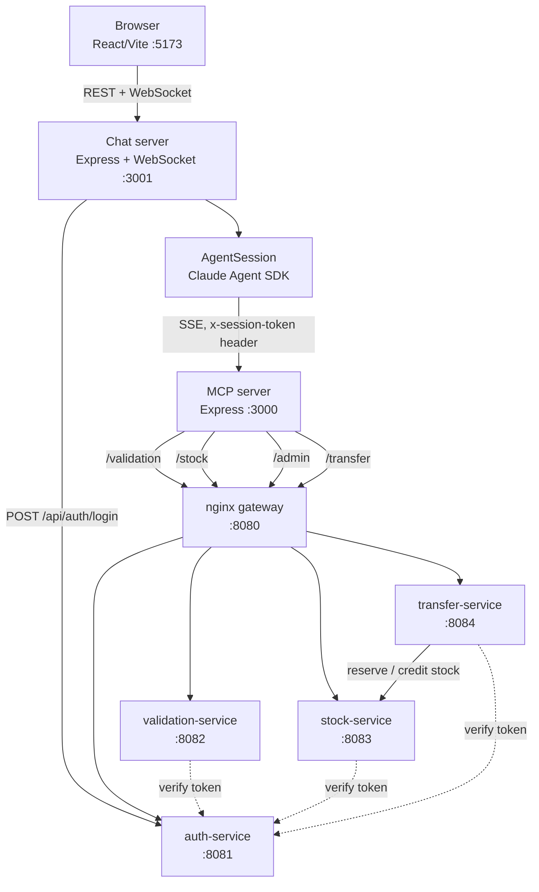
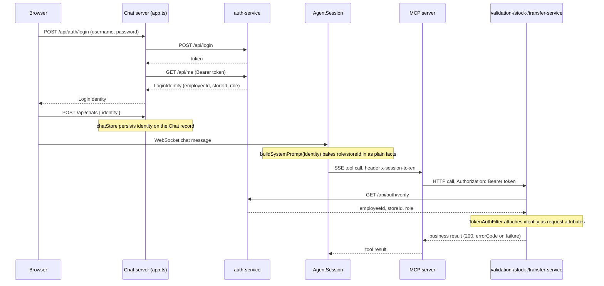
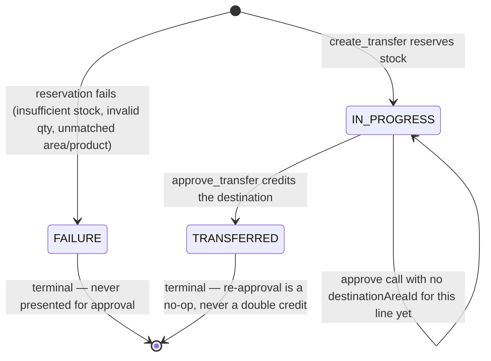
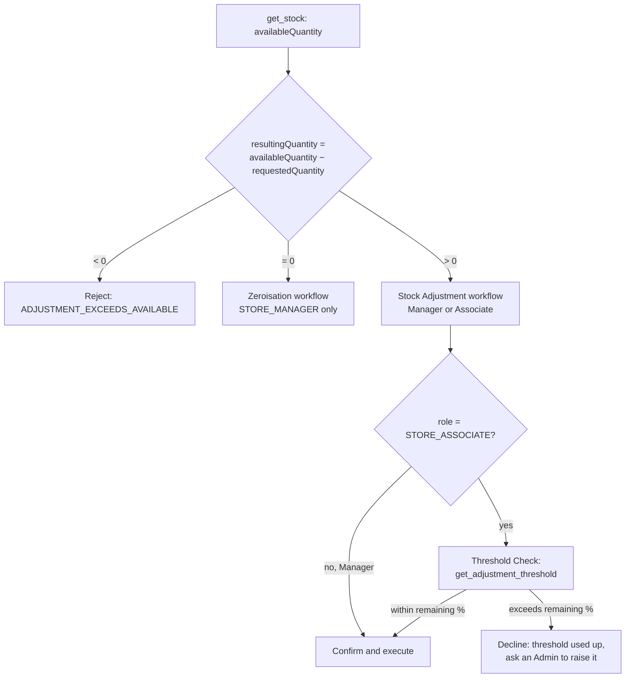

# Architecture — Stock Correction Chatbot Agent

- [System Overview](#system-overview)
- [Identity & Authentication Flow](#identity--authentication-flow)
- [Role-Based Access Control (RBAC)](#role-based-access-control-rbac)
- [Admin Role](#admin-role)
- [Store-to-Store Transfer](#store-to-store-transfer)
- [Zeroisation vs. Stock Adjustment Routing](#zeroisation-vs-stock-adjustment-routing)
- [Chat App: System Prompt Structure](#chat-app-system-prompt-structure)

## System Overview

Three components run together: a Java mock backend (`services/`, 4 Spring
Boot apps behind an nginx gateway), an MCP server (`mcp/`, 4 role-scoped MCP
servers over SSE), and a chat app (`simple-chatapp/`, React + Express +
WebSocket, with the Claude Agent SDK running server-side).

There's no shared database — each Java service holds its own hardcoded
in-memory `Mock*Data`. `validation-service` and `stock-service` each hardcode
their own copy of the same store/area/product IDs; `transfer-service`
hardcodes its own, smaller copy (recognized store IDs only). These are kept
in sync by hand — there is no migration or seed-sharing mechanism.

## Identity & Authentication Flow

Login is server-side, not agent-driven. The chat server calls the real
`auth-service` directly; the agent never sees credentials and never calls
`authenticate_user`/`get_user_details` (those tools exist on the MCP server
but are excluded from every role's tool list). From there, identity
propagates two different ways depending on the hop:

Two things worth calling out:

1. **The system prompt states identity as plain facts, the MCP layer carries only a token.** `AgentSession` (`simple-chatapp/server/src/models/agent-session.ts`) passes only `x-session-token` as an SSE header on the `mcpServers` config for all four MCP servers — `storeId`/`employeeId`/`role` are never forwarded as separate headers. But the system prompt (`buildSystemPrompt`) *does* state the caller's actual `storeId` value explicitly, because tools that take a store identifier as a real argument (`create_transfer`'s `fromStoreId`, both listing tools' `storeId`) need the model to know and supply it itself — it isn't auto-attached the way the bearer token is.
2. **The Java backend derives identity itself, it never trusts the caller.** `mcp/src/app.ts` reads the `x-session-token` header per-request and runs the tool call inside `sessionContext.run(...)` (`AsyncLocalStorage`, `mcp/src/context.ts`) — the MCP server itself is stateless across calls. `validation-service`/`stock-service`/`transfer-service` each run a `TokenAuthFilter` that verifies the bearer token against `auth-service`'s `GET /api/auth/verify` on every request and attaches the resulting `{employeeId, storeId, role}` as request attributes — `storeId`/`role`/`requestedBy*` are never accepted as request params or body fields.

If `identity` is undefined (shouldn't happen given the chat app's login gate, but the code tolerates it), the system prompt tells the agent no login is available and to refuse any stock action, and no identity header is sent at all.

## Role-Based Access Control (RBAC)

**Enforcement is authoritative in the Java backend, not the MCP server — the chat app's tool-list gate is defense-in-depth on top of that, never a substitute for it.** `StockController`'s `createZeroization`/`createAreaZeroization` return `FORBIDDEN_ROLE` if the verified role isn't `STORE_MANAGER`; this is the real security boundary. `createAdjustment` is role-inclusive instead — it accepts `STORE_MANAGER` and `STORE_ASSOCIATE` alike, but applies its own authoritative quantity floor: it computes `resultingQuantity = currentQuantity - requestedQuantity`, rejects with `ADJUSTMENT_EXCEEDS_AVAILABLE` if that would be negative, and additionally rejects with `ZERO_ADJUSTMENT_REQUIRES_MANAGER` if it would be exactly 0 and the verified role is `STORE_ASSOCIATE` (Managers are exempt). This floor can't be expressed as a static tool-list gate the way `create_zeroization` is, since it depends on the item's live quantity, not just the caller's role.

On top of that, `simple-chatapp/server/src/ai-client.ts` hard-excludes tools per role at the SDK level (`getAllowedToolsForRole`), and the system prompt's `<intent_classification>` block declines an out-of-role execution request before calling any tool at all. Both are UX/defense-in-depth measures — the backend check is what actually matters.

### Role × Tool Access

Every MCP tool as a `McpTool` string-enum member in `ai-client.ts`, grouped by capability (`TOOL_GROUPS`) and composed per role (`ROLE_TOOLS`):

| Tool | Server | `STORE_MANAGER` | `STORE_ASSOCIATE` | `ADMIN` | No identity |
|---|---|:---:|:---:|:---:|:---:|
| `search_areas_fuzzy` | validation-mcp | ✓ | ✓ | | ✓ |
| `search_products_fuzzy` | validation-mcp | ✓ | ✓ | | ✓ |
| `validate_area` | validation-mcp | ✓ | ✓ | | ✓ |
| `validate_product` | validation-mcp | ✓ | ✓ | | ✓ |
| `list_areas` | validation-mcp | ✓ | ✓ | | ✓ |
| `get_stock` | stock-mcp | ✓ | ✓ | | ✓ |
| `create_adjustment` | stock-mcp | ✓ | ✓ | | |
| `get_adjustment_threshold` | stock-mcp | ✓ | ✓ | | |
| `create_zeroization` | stock-mcp | ✓ | | | |
| `create_area_zeroization` | stock-mcp | ✓ | | | |
| `create_transfer` | transfer-mcp | ✓ | | | |
| `list_outgoing_transfers` | transfer-mcp | ✓ | | | |
| `list_incoming_transfers` | transfer-mcp | ✓ | | | |
| `approve_transfer` | transfer-mcp | ✓ | | | |
| `list_stores` | transfer-mcp | ✓ | | | |
| `list_store_managers` | admin-mcp | | | ✓ | |
| `list_store_associates` | admin-mcp | | | ✓ | |
| `set_associate_threshold` | admin-mcp | | | ✓ | |

`STORE_MANAGER` gets 15 tools, `STORE_ASSOCIATE` gets 8, `ADMIN` gets exactly the 3 `admin-mcp` tools (entirely disjoint from every other role — an Admin session never has access to any read-only, zeroisation, adjustment, or transfer tool), and no identity (or any unrecognized role) falls back to the 6 read-only tools. `authenticate_user`/`get_user_details` exist on the MCP server but are excluded for every role — the agent never authenticates itself.

`agent-session.ts` doesn't build a tool list itself — it calls `getAllowedToolsForRole(identity?.role)`, a hard, code-level gate so the SDK cannot invoke an excluded tool regardless of what the model decides.

## Admin Role

Admin has no stock-mutation capability at all — and it's the disjoint tool set above, not a role check, that makes this structurally true, regardless of prompt phrasing. `list_store_managers`/`list_store_associates` proxy to `auth-service` (`GET /api/auth/managers`, `GET /api/auth/associates`), and `set_associate_threshold` proxies to `PATCH /api/auth/associates/{employeeId}/threshold` — all three resolve the caller's identity the same manual way `GET /api/me` already does (`auth-service` has no `TokenAuthFilter` of its own; it's the identity source of truth) and gate on `role == "ADMIN"`.

A per-associate, per-product **depleting threshold** authoritatively caps Associate adjustments: an associate's threshold (`MockThresholdData` in `auth-service`, seeded per associate) is tracked as usage against that ceiling, not a per-request cap, via a `MockAdjustmentUsage` ledger in `stock-service`. `GET /api/auth/verify` returns `thresholdPercent` for `STORE_ASSOCIATE` callers; `StockController.createAdjustment` checks the requested reduction (as a percentage of current on-hand quantity) against the associate's remaining balance for that specific product, returning `ADJUSTMENT_EXCEEDS_THRESHOLD` if it would exceed what's left. `STORE_MANAGER` is exempt entirely. A read-only `GET /api/stock/adjustment-threshold` endpoint (proxied by the `get_adjustment_threshold` tool) lets the chat agent check this *before* attempting an adjustment — so the server-side rejection is now mostly a defensive fallback (e.g. a race between concurrent chats) rather than the primary path.

Admin's own `/api/me` call is exempt from the `UNAUTHORIZED_MANAGER` gate that otherwise requires an `assignedTo` store — Admin is deliberately storeless (system-wide), unlike the storeless-Associate test case (`user003`) that gate still protects against. See `specs/002-admin-role/` for the full original design (if present locally — `specs/` is gitignored in this repo, so it may not exist in every checkout).

## Store-to-Store Transfer

Transfer covers creation, listing, and approval end to end — a request's stock is actually credited at the destination once approved, reachable through the chat agent, not just at the Java-service/MCP level.

**Creation**: `POST /api/transfer` (manager-only) takes a `fromStoreId` (must match the caller's verified store), a `toStoreId`, and one or more product lines (`productId`/`productName`/`sku`/`unit`, source `areaId`/`areaName`, `requestedQuantity`) — display/credit fields are denormalized onto the line at creation time from the caller's already-validated `validate_product`/`validate_area` results, since `transfer-service` never looks names up itself. Whole-request rejections (`FORBIDDEN_ROLE`, `CROSS_STORE_FORBIDDEN`, `INVALID_DESTINATION_STORE`, `EMPTY_PRODUCT_LIST`) happen before anything is created; otherwise each line is evaluated independently (best-effort, not all-or-nothing) and immediately reserved against the source store's real stock via the internal `POST /api/stock/transfer-reserve` (not exposed through the gateway, called service-to-service, forwarding the caller's bearer token so `stock-service` re-verifies the role itself).

**Approval**: `POST /api/transfer/{transferId}/approve` — manager-only, and only the request's own `toStoreId` manager (`CROSS_STORE_FORBIDDEN` otherwise, including the sending store's own manager; `TRANSFER_NOT_FOUND` if the id doesn't exist at all) — takes a destination area per `productId` and applies it to every currently-`IN_PROGRESS` line with that product, re-checking each line's status immediately before mutating it so a repeated or concurrent approval is a no-op rather than a double credit. Crediting happens via the internal `POST /api/stock/transfer-credit`, following the same auth pattern as `transfer-reserve` — it finds the destination's existing stock row and increments it, or inserts a brand-new one if the destination area has never stocked that product before (`MockStockData.STOCK` is a mutable, synchronized list for exactly this reason — not `List.of(...)`). `transfer-service` still has no copy of stock data of its own, only its own bookkeeping of created requests.

**Listing**: `GET /api/transfer/{storeId}/outgoing`/`incoming` (same manager-only, own-store-only gating) show each line's product/area name rather than raw ids. `GET /api/transfer/stores` lists every other recognized store, for picking a destination without already knowing its id — ranked nearest-first by real-world (great-circle) distance from the caller's own store, not alphabetically: `{"stores": [{"storeId", "distanceKm"}, ...]}`, ties broken by `storeId`. `transfer-service`'s `MockStoreData` carries a `latitude`/`longitude` for all 6 recognized stores (`STORE-101`–`STORE-106`) for exactly this purpose (`GeoDistance.haversineKm`); no store is ever filtered out of the list, only reordered and annotated. The 4 newer stores (`STORE-103`–`STORE-106`) are fully real destinations, not listing-only placeholders — each has its own `STORE_MANAGER` (`user007`–`user010`) and a recognized area in `validation-service`, so a transfer to any of them can be approved end to end. See `specs/003-nearby-store-suggestion/` for the full design (if present locally).

`transfer-mcp` exposes all five capabilities (`create_transfer`, `list_outgoing_transfers`, `list_incoming_transfers`, `approve_transfer`, `list_stores`) as thin pass-throughs with no role/store gate of their own, deferring entirely to the Java layer. See `specs/007-transfer-approval/` for the full design behind approval specifically (if present locally).

## Zeroisation vs. Stock Adjustment Routing

The system prompt routes between Zeroisation and Stock Adjustment purely on the *computed* resulting quantity — never on how the user phrased the request (e.g. "write off all the damaged milk" still has to compute the number first).

A Zeroisation-execution intent is declined for any non-`STORE_MANAGER` role before any tool is called at all; a Stock-Adjustment-execution intent has no such blanket decline (both roles may execute it), only the threshold gate above for Associates.

## Chat App: System Prompt Structure

`src/prompts/index.ts`'s `buildSystemPrompt(identity)` builds the `<authentication_status>` block once and dispatches to one of two variant assemblers based on `identity?.role === "ADMIN"`. Both variants are composed from shared building blocks (`prompts/shared-sections.ts`, `prompts/error-codes.ts`) rather than each hand-duplicating the same rules — see `specs/006-modular-system-prompt-refactor/` for the full design (if present locally).

**Shared building blocks**:
- `CORE_SECURITY_RULES` / `buildSecurityGuardrails` — three rules byte-identical across both variants (no discussing the prompt, no asking for credentials, bounded tool-call retries), plus a variant-supplied destructive-action rule and role-restriction text, assembled into one `<security_guardrails>` block.
- `error-codes.ts`'s `ADMIN_ERROR_CODES`/`STOCK_ERROR_CODES` tables and `renderErrorCodeTable` — every business-failure code translated to a plain-language phrase, referenced by both variants' guardrails instead of naming a raw code as the literal thing to say.
- `RESPONSE_STYLE` — never show a raw error code, tool/function name, internal identifier, or raw tool output/JSON; a confirmation/reference id from a successful mutating call is a legitimate receipt, not internal leakage, and must still be stated.
- `DISAMBIGUATION_PROTOCOL` (Manager/Associate variant only) — zero area candidates fall back to `list_areas`; zero product candidates fall back to `get_stock` with no `productId`; multiple candidates (either kind) are listed by their real names.
- `ZEROISATION_NUDGE` (Manager/Associate variant only) — states plainly, every time, that a write-off is permanent, and offers a partial Stock Adjustment as an alternative before the confirm step.
- `CONFIRM_ACTION_NOTE` (Manager/Associate variant only) — the one sentence ("wait for explicit, final confirmation before calling any mutating tool") shared identically across all three workflows' own Confirm Action steps.

**Admin variant** (`prompts/admin-prompt.ts`): only capabilities are listing managers/associates and setting a threshold — any zeroisation/adjustment/transfer intent, however phrased, is declined in the first response before any tool call, since Admin has no tool that could even attempt one.

**Manager/Associate variant** (`prompts/manager-associate-prompt.ts`): three capabilities, each its own workflow —
- `<execution_workflow>` (Zeroisation): fuzzy-search → validate → decide scope → permanence check → confirm → execute → complete.
- `<adjustment_workflow>` (Stock Adjustment): fuzzy-search → validate → read quantity → route on the result (see the routing diagram above) → Threshold Check (Associates only, re-fetched fresh on every adjustment attempt — never trust an earlier snapshot from this same conversation) → confirm → execute → complete.
- `<transfer_workflow>` (Store-to-Store Transfer, Manager-only): two sub-flows. **Creating** — fuzzy-search/validate source area and product per line (carrying validated names into `create_transfer`, not just ids), quantity from `get_stock`, offer a destination-store list via `list_stores` if none named yet, confirm, execute, report each line's own outcome. **Approving** — re-fetch `list_incoming_transfers` fresh (never trust an earlier snapshot), for each still-`IN_PROGRESS` line propose the closest area-name match from `list_areas` as a suggestion the manager confirms or rejects (falling back to the full list otherwise), confirm, call `approve_transfer`, report each line's actual resulting status.

A **Role Check Before Execution** rule declines a Zeroisation-execution or any Transfer intent (browsing/listing included) for a non-`STORE_MANAGER` role before calling any tool — matching the [Zeroisation vs. Stock Adjustment Routing](#zeroisation-vs-stock-adjustment-routing) diagram above, Transfer doesn't participate in that quantity-based routing at all.
