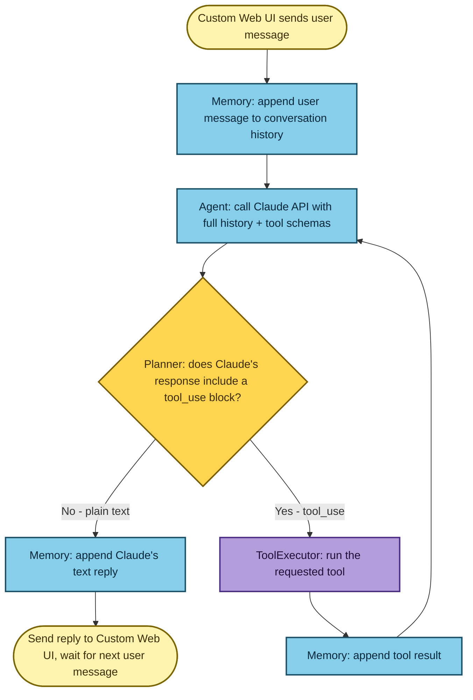

# Phase 1 — Design Spec

## Purpose

The Stock Platform Chatbot lets store managers perform stock correction activities through a conversational interface instead of manual forms. Phase 1 covers **Zeroisation only** — writing off all on-hand quantity of a product (or an entire area) when it is damaged, expired, or spoiled.

## Roles

| Role | What they do |
|---|---|
| Store Manager | Submit zeroisation requests via the chat UI |
| Store Associate | Capable in the underlying role model; Phase 1 demo uses Manager accounts only (see Assumptions) |
| Inventory Operations Team | Monitor corrections via audit logs |

## Phase roadmap

| Phase | Scope |
|---|---|
| **1 — Zeroisation** (this sprint) | Custom web UI, Node/Claude-SDK agent, mocked auth, mock Java APIs, simulated Kafka, real structured logging |
| 2 — Waste Adjustment | Partial quantity write-off; new reason codes (`overstock`, `promotional_waste`) |
| 3 — Store-to-Store Transfer | Destination store + `TransferAPI`; first cross-store auth check |
| 4 — Approval workflow | Store Manager approval gate for high-value/bulk requests |
| 5 — Real infrastructure | Swap in-memory repos for real DB; real Kafka broker |
| 6 — Org SSO + hardening | Replace mock auth with SAML/OIDC; formal security review |

## What the agent can and cannot do in Phase 1

The agent is conversational from the first turn — there is no preset options menu. When the user's message implies an unsupported request type, the agent recognises the shape and declines conversationally:

| Shape recognised | Agent action |
|---|---|
| Full write-off (damaged/expired/spoiled, no partial quantity implied) | Proceeds as Zeroisation |
| Partial quantity implied (e.g. "we threw away 20 bottles") | Declines; offers to zero the product entirely instead |
| Destination store implied (e.g. "we sent 3 cartons to Whitefield") | Declines; names Zeroisation as what it can currently help with |

**Key constraint: no quantity is ever collected from the user.** The user names a product and a reason; the system looks up the current on-hand quantity and zeroes it. If a user message states a number, it is ignored.

## End-to-end user flow

### Single-product zeroisation

1. User opens the web chat UI and sees a login form.
2. User enters username and password. The server calls the Auth service directly (not via the agent). Failure → clear rejection, session ends.
3. Auth service confirms the employee is an authorised store manager and returns their `storeId`. The agent is told it is already logged in and never asks for credentials.
4. Agent greets the user with an open-ended question: *"Hi Priya, what would you like to do?"*
5. User describes the situation in free text, e.g. *"the eggs in Refrigerator X are damaged."*
6. Agent identifies the intent as Zeroisation, extracts the product ("eggs") and area ("Refrigerator X") from free text.
7. **If no area was named**, the agent asks for one — there is no store-wide product search, so an area is always required before validation.
8. Agent calls `search_areas_fuzzy` with a formal expansion of the user's term (e.g. "fridge" → "refrigerator") to get candidates. If multiple candidates return, the agent asks the user to clarify. Once one candidate is confirmed, it calls `validate_area` to get the `areaId`.
9. Agent calls `search_products_fuzzy` within the validated area, then `validate_product`. If not found, the agent tells the user exactly what didn't match and asks them to correct it.
10. Agent calls `get_stock` to read `availableQuantity`. If zero, the agent tells the user there is nothing to write off.
11. Agent confirms with the user before acting: *"I found 120 BOX of eggs in Refrigerator X — zero them out?"*
12. On confirmation, agent calls `create_zeroization`. The `quantity` is the `availableQuantity` from step 10 — never a user-supplied number. The user's free-text reason is mapped to a fixed reason code (e.g. `SPOILED`); the original wording is kept in `remarks`.
13. On success, the agent shows the confirmation reference (`zeroizationId`, item zeroed). The backend logs the event it would publish to `stock.zeroisation.completed`.

### Whole-area zeroisation

Used when the user means every product in an area (e.g. *"the whole dairy fridge lost power overnight"*).

After `validate_area` succeeds:

1. Agent calls `get_stock` with no `productId` to get every product in the area and its quantity. An empty list → agent tells the user there is nothing stocked there.
2. Agent confirms the **full product list** before acting, e.g. *"This will zero out 4 products in Dairy: Eggs (120 BOX), Milk 1L (40 BOX) — proceed?"*
3. On confirmation, agent calls `create_area_zeroization` with a single `reason`/`remarks` pair covering the whole area.

> If the user gives different reasons for different products in the same area, that is not a whole-area request — it is handled as multiple single-product requests.

## Flowcharts

### Agent turn loop

Every conversational step in the business flow runs through this loop.

### Zeroisation business flow

```mermaid
flowchart TD
    Start(["User opens custom web chat UI"]) --> Auth

    Auth["Ask for username / password"] --> ToolLogin
    ToolLogin["ToolExecutor: authenticate_user"] --> AuthAPI
    AuthAPI[("Spring Boot: AuthAPI - POST /api/login")] --> LoginOK{"Login successful?"}
    LoginOK -->|"No"| Reject["Reply: invalid credentials"] --> End1(["End"])
    LoginOK -->|"Yes: token"| ToolMe

    ToolMe["ToolExecutor: get_user_details"] --> MeAPI
    MeAPI[("Spring Boot: AuthAPI - GET /api/me")] --> AuthorizedCheck{"authorized: true?"}
    AuthorizedCheck -->|"No: UNAUTHORIZED_MANAGER"| RejectAuth["Reply: not authorised as a manager"] --> End4(["End"])
    AuthorizedCheck -->|"Yes: employee_id, name, assignedTo"| AskOpen

    AskOpen["Ask open-ended: what would you like to do?"] --> ParseItems
    ParseItems["Recognise intent shape, extract product + reason + area"] --> IntentCheck
    IntentCheck{"Which shape?"}
    IntentCheck -->|"Waste-shaped"| DeclineWaste["Reply: partial adjustments not supported, offer full zero-out"] --> AskOpen
    IntentCheck -->|"Transfer-shaped"| DeclineTransfer["Reply: transfers not supported"] --> AskOpen
    IntentCheck -->|"Zeroisation-shaped"| AreaNamed

    AreaNamed{"Was an area named?"}
    AreaNamed -->|"No"| AskArea["Ask: which area is the product in?"] --> ToolValidateArea
    AreaNamed -->|"Yes"| ToolValidateArea

    ToolValidateArea["ToolExecutor: search_areas_fuzzy + validate_area"] --> AreaAPI
    AreaAPI[("Spring Boot: ValidationAPI")] --> AreaExists{"exists?"}
    AreaExists -->|"No: AREA_NOT_FOUND"| AskAreaFix["Ask user to restate area name"] --> ToolValidateArea
    AreaExists -->|"Yes: areaId"| ProductScope

    ProductScope{"Specific product, or whole area?"}
    ProductScope -->|"Specific product"| ToolValidateProduct
    ProductScope -->|"Whole area"| ToolGetAreaStock

    ToolValidateProduct["ToolExecutor: search_products_fuzzy + validate_product"] --> ProductAPI
    ProductAPI[("Spring Boot: ValidationAPI")] --> ProductExists{"exists?"}
    ProductExists -->|"No: PRODUCT_NOT_FOUND"| AskProductFix["Ask user to correct product name or area"] --> ToolValidateProduct
    ProductExists -->|"Yes: productId"| ToolGetStock

    ToolGetStock["ToolExecutor: get_stock (single product)"] --> StockAPI1
    StockAPI1[("Spring Boot: StockAPI - GET /api/stock")] --> QtyCheck{"availableQuantity > 0?"}
    QtyCheck -->|"No"| ReportZero["Reply: nothing to write off"] --> End3(["End"])
    QtyCheck -->|"Yes"| ConfirmItems

    ConfirmItems["Show quantity + area, ask user to confirm"] -->|"user confirms"| ToolCreateZero
    ToolCreateZero["ToolExecutor: create_zeroization"] --> StockAPI2
    StockAPI2[("Spring Boot: StockAPI - POST /api/stock/zeroization")] --> ZeroStatus{"status: SUCCESS?"}
    ZeroStatus -->|"No: ZEROIZATION_FAILED"| ReportFail["Reply: failed, offer to retry"] --> End5(["End"])
    ZeroStatus -->|"Yes: zeroizationId"| Kafka

    ToolGetAreaStock["ToolExecutor: get_stock (no productId)"] --> StockAPI3
    StockAPI3[("Spring Boot: StockAPI - GET /api/stock area-wide")] --> ProductsCheck{"any products in area?"}
    ProductsCheck -->|"No"| ReportEmpty["Reply: nothing stocked here"] --> End6(["End"])
    ProductsCheck -->|"Yes"| ConfirmArea

    ConfirmArea["Show full product list + quantities, ask user to confirm"] -->|"user confirms"| ToolCreateAreaZero
    ToolCreateAreaZero["ToolExecutor: create_area_zeroization"] --> StockAPI4
    StockAPI4[("Spring Boot: StockAPI - POST /api/stock/zeroization/area")] --> AreaZeroStatus{"status: SUCCESS?"}
    AreaZeroStatus -->|"No: ZEROIZATION_FAILED"| ReportAreaFail["Reply: failed, offer to retry"] --> End7(["End"])
    AreaZeroStatus -->|"Yes: zeroizationId"| Kafka

    Kafka{{"Kafka topic: stock.zeroisation.completed (simulated)"}} --> Confirm
    Confirm["Show final confirmation to user"] --> End2(["End"])

    classDef uiLayer fill:#FFF3B0,stroke:#7a6500,stroke-width:2px,color:#3a2f00
    classDef agentLayer fill:#87CEEB,stroke:#1a4f66,stroke-width:2px,color:#04283a
    classDef toolLayer fill:#B39DDB,stroke:#4a2c82,stroke-width:2px,color:#1f0f38
    classDef apiLayer fill:#90EE90,stroke:#1f5c1f,stroke-width:2px,color:#0d2b0d
    classDef decision fill:#FFD54F,stroke:#7a5c00,stroke-width:2px,color:#3a2c00
    classDef eventLayer fill:#F8BBD0,stroke:#88134f,stroke-width:2px,color:#4a0a2c

    class Start,End1,End2,End3,End4,End5,End6,End7 uiLayer
    class Auth,AskOpen,ParseItems,DeclineWaste,DeclineTransfer,AskArea,AskAreaFix,AskProductFix,ConfirmItems,ConfirmArea,ReportZero,ReportFail,ReportEmpty,ReportAreaFail,Confirm,Reject,RejectAuth agentLayer
    class ToolLogin,ToolMe,ToolValidateArea,ToolValidateProduct,ToolGetStock,ToolCreateZero,ToolGetAreaStock,ToolCreateAreaZero toolLayer
    class AuthAPI,MeAPI,AreaAPI,ProductAPI,StockAPI1,StockAPI2,StockAPI3,StockAPI4 apiLayer
    class LoginOK,AuthorizedCheck,IntentCheck,AreaNamed,AreaExists,ProductScope,ProductExists,QtyCheck,ZeroStatus,ProductsCheck,AreaZeroStatus decision
    class Kafka eventLayer
```

