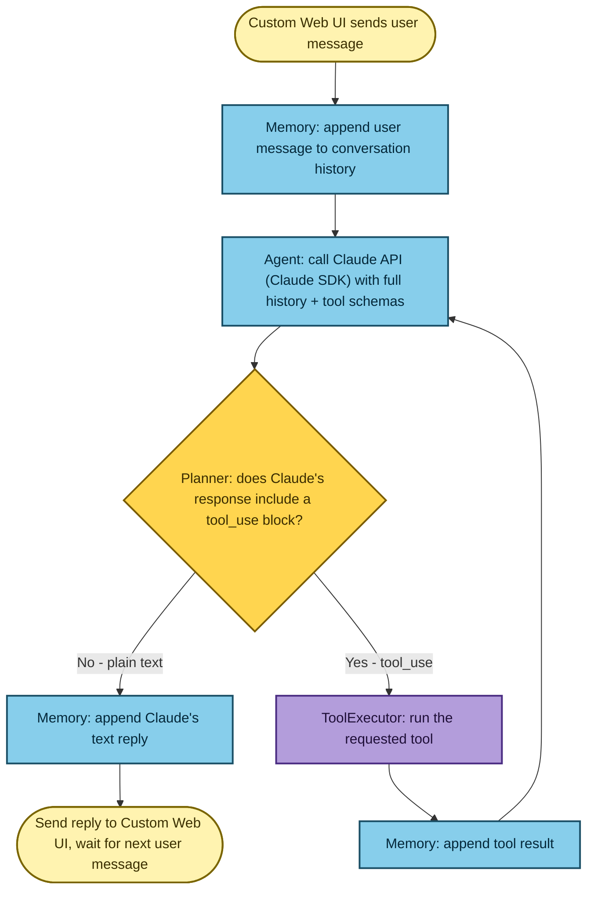
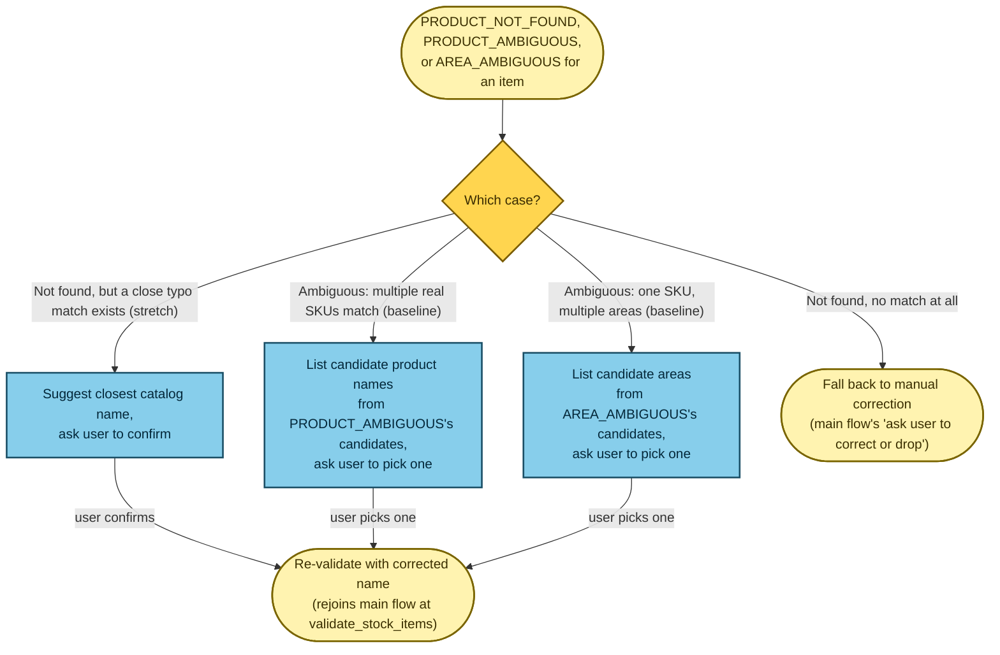

# Phase 1 — Zeroisation Flowchart

Same proven style as `docs/superpowers/specs/2026-07-06-stock-platform-chatbot-zeroisation-flowchart-custom-ui.md`:
single top-to-bottom chains, color-coded by tech-stack layer, no
side-by-side lanes — that's what avoids crossing edges. Three diagrams:
the generic agent-turn loop, the main business flow, and the product-name
and area resolution sub-flow (kept separate so it doesn't force a second
feedback loop into the main chain).

## Tech stack per layer (color legend)

| Color | Layer | Tech | Role |
|---|---|---|---|
| 🟡 pale yellow | Custom Web UI | Browser (HTML/JS) | Renders chat, sends user input, displays replies |
| 🟦 blue | Agent + Planner + Memory | Node.js backend, Claude API via Claude SDK | Calls Claude API with history + tool schemas; Planner decides reply-vs-tool-call; Memory holds conversation history |
| 🟪 purple | ToolExecutor | Node.js | `authenticate_user`, `list_store_areas`, `validate_stock_items`, `submit_zeroisation_request` |
| 🟩 green | Mock API service | Java Spring Boot | AuthAPI, ValidationAPI, StockAPI — in-memory, production-shaped |
| 🟨 gold (diamond) | — | — | Decision point |
| 🟥 pink (hexagon) | Event bus | Kafka (simulated) | `stock.zeroisation.completed` topic |

## 1. Agent turn loop

Every conversational step in the business flow below runs through this —
not redrawn at each step, to keep the main diagram readable.

## 2. Zeroisation business flow

Adds a store-scope-authorization decision (separate from "product
valid?") that wasn't in the earlier brainstorming version of this
flowchart, per `api-contract.md`'s `STORE_MISMATCH` check. No preset
options menu — after auth, the agent asks an open-ended question and
recognizes intent from free text (see `phase_1_plan.md`'s "Recognizing
intent without a menu").

```mermaid
flowchart TD
    Start(["User opens custom web chat UI"]) --> Auth

    Auth["Ask for username / password<br/>(runs through Agent turn loop above)"] --> ToolAuth
    ToolAuth["ToolExecutor: authenticate_user"] --> AuthAPI
    AuthAPI[("Spring Boot: AuthAPI")] --> AuthOK{"Authenticated?"}
    AuthOK -->|"No: 401 INVALID_CREDENTIALS"| Reject["Reply: invalid credentials, no options shown"] --> End1(["End"])
    AuthOK -->|"Yes: 200 user_id, role, store_id, token"| AskOpen

    AskOpen["Ask open-ended: what would you like to do?<br/>(no preset options)"] --> ParseItems
    ParseItems["Parse free text: recognize intent shape,<br/>extract product(s) + reason if Zeroisation-shaped"] --> IntentCheck
    IntentCheck{"Which shape?<br/>(Zeroisation / Waste / Transfer)"}
    IntentCheck -->|"Waste-shaped: partial quantity implied"| DeclineWaste["Reply: partial adjustments not supported yet,<br/>offer to zero out the product entirely instead"] --> AskOpen
    IntentCheck -->|"Transfer-shaped: destination store implied"| DeclineTransfer["Reply: transfers not supported yet,<br/>name Zeroisation as what's currently supported"] --> AskOpen
    IntentCheck -->|"Zeroisation-shaped: full write-off"| LocationCheck

    LocationCheck{"Does message imply a location?<br/>(e.g. 'near some x area')"}
    LocationCheck -->|"No"| ToolValidate
    LocationCheck -->|"Yes"| ListAreas
    ListAreas["ToolExecutor: list_store_areas"] --> AreaAPI
    AreaAPI[("Spring Boot: ValidationAPI (areas)")] --> ResolveArea
    ResolveArea["Claude matches the phrase against area<br/>descriptions to resolve area_code<br/>(asks user to clarify if unsure)"] --> ToolValidate

    ToolValidate["ToolExecutor: validate_stock_items"] --> ValidationAPI
    ValidationAPI[("Spring Boot: ValidationAPI")] --> StoreOK{"Store-scope OK?<br/>token store_id == request store_id"}
    StoreOK -->|"No: 403 STORE_MISMATCH"| RejectStore["Reply: not authorized for this store<br/>(logged as security event)"] --> End3(["End"])
    StoreOK -->|"Yes"| AllValid{"All items valid?<br/>(product exists, not already zero)"}

    AllValid -->|"No: PRODUCT_NOT_FOUND / PRODUCT_AMBIGUOUS /<br/>AREA_AMBIGUOUS / ALREADY_ZERO<br/>(see resolution sub-flow for handling)"| ReportInvalid["Report invalid item(s) and why"]
    ReportInvalid --> AskFix["Ask user to correct, drop, or pick<br/>from candidates for invalid item(s)"]
    AskFix -->|"corrected item(s)"| ToolValidate

    AllValid -->|"Yes: results all valid"| ConfirmItems
    ConfirmItems["Show discovered on-hand quantity AND resolved<br/>area per item, ask user to confirm before zeroing"] -->|"user confirms"| ToolSubmit
    ToolSubmit["ToolExecutor: submit_zeroisation_request"] --> StockAPI
    StockAPI[("Spring Boot: StockAPI")] -->|"200 request_id, status COMPLETED"| Kafka
    Kafka{{"Kafka topic: stock.zeroisation.completed (simulated)"}} -->|"event consumed downstream"| Confirm
    Confirm["Show final confirmation to user"] --> End2(["End"])

    classDef uiLayer fill:#FFF3B0,stroke:#7a6500,stroke-width:2px,color:#3a2f00
    classDef agentLayer fill:#87CEEB,stroke:#1a4f66,stroke-width:2px,color:#04283a
    classDef toolLayer fill:#B39DDB,stroke:#4a2c82,stroke-width:2px,color:#1f0f38
    classDef apiLayer fill:#90EE90,stroke:#1f5c1f,stroke-width:2px,color:#0d2b0d
    classDef decision fill:#FFD54F,stroke:#7a5c00,stroke-width:2px,color:#3a2c00
    classDef eventLayer fill:#F8BBD0,stroke:#88134f,stroke-width:2px,color:#4a0a2c

    class Start,End1,End2,End3 uiLayer
    class Auth,AskOpen,ParseItems,DeclineWaste,DeclineTransfer,ResolveArea,ConfirmItems,ReportInvalid,AskFix,Confirm,Reject,RejectStore agentLayer
    class ToolAuth,ToolValidate,ToolSubmit,ListAreas toolLayer
    class AuthAPI,ValidationAPI,StockAPI,AreaAPI apiLayer
    class AuthOK,AllValid,StoreOK,IntentCheck,LocationCheck decision
    class Kafka eventLayer
```

## 3. Product-name and area resolution sub-flow (typo-suggestion is stretch; disambiguation is baseline)

What happens inside "Report invalid item(s) and why" above. Three
distinct paths live here, per `api-contract.md`'s `PRODUCT_NOT_FOUND` /
`PRODUCT_AMBIGUOUS` / `AREA_AMBIGUOUS` split: a near-miss spelling gets a
single suggested correction (**stretch, droppable per
`phase_1_plan.md`'s cut line**), while a generic name matching multiple
real SKUs, or matching one SKU stocked in multiple areas, each get a
pick-one list (**baseline — always built**, since resolving ambiguity
itself instead of requiring the user to be precise upfront is the whole
point of this design). Kept as its own small diagram rather than a second
feedback loop in the main chain above, to keep that chain crossing-free.

