# Phase 1 — Zeroisation Flowchart

Same proven style as `docs/superpowers/specs/2026-07-06-stock-platform-chatbot-zeroisation-flowchart-custom-ui.md`:
single top-to-bottom chains, color-coded by tech-stack layer, no
side-by-side lanes — that's what avoids crossing edges. Two diagrams: the
generic agent-turn loop, and the main business flow. There's no separate
disambiguation sub-flow anymore — `api-contract.md` has no candidate-list
endpoints, so every not-found case is a simple retry loop folded directly
into the main chain below.

## Tech stack per layer (color legend)

| Color | Layer | Tech | Role |
|---|---|---|---|
| 🟡 pale yellow | Custom Web UI | Browser (HTML/JS) | Renders chat, sends user input, displays replies |
| 🟦 blue | Agent + Planner + Memory | Node.js backend, Claude API via Claude SDK | Calls Claude API with history + tool schemas; Planner decides reply-vs-tool-call; Memory holds conversation history |
| 🟪 purple | ToolExecutor | Node.js | `authenticate_user`, `get_user_details`, `validate_area`, `validate_product`, `get_stock`, `create_zeroization`, `create_area_zeroization` |
| 🟩 green | Mock API service | Java Spring Boot | AuthAPI (`/api/login`, `/api/me`), ValidationAPI (`/api/validation/area`, `/api/validation/product`), StockAPI (`/api/stock` — single product or whole area, `/api/stock/zeroization`, `/api/stock/zeroization/area`) — in-memory, production-shaped |
| 🟨 gold (diamond) | — | — | Decision point |
| 🟥 pink (hexagon) | Event bus | Kafka (simulated) | `stock.zeroisation.completed` topic |

## 1. Agent turn loop

Every conversational step in the business flow below runs through this —
not redrawn at each step, to keep the main diagram readable.

## 2. Zeroisation business flow

Auth is now two calls, not one: `POST /api/login` just returns a token;
`GET /api/me` is what confirms the employee is an authorized manager and
gets the store they're scoped to (`assignedTo`). No preset options
menu — after auth, the agent asks an open-ended question and recognizes
intent from free text (see `phase_1_plan.md`'s "Recognizing intent without
a menu"). Area and product validation are single-guess-and-retry, per
`phase_1_plan.md`'s "Area and product resolution" — there's no candidate
list to offer, so a not-found response just loops back to the same
validation call with a corrected guess. Once the area is validated, the
flow splits: a specific product goes through `get_stock`/
`create_zeroization` one at a time; "zero the whole area" goes through the
area-wide forms of the same two endpoints instead, per `phase_1_plan.md`'s
"Whole-area zeroization."

```mermaid
flowchart TD
    Start(["User opens custom web chat UI"]) --> Auth

    Auth["Ask for username / password<br/>(runs through Agent turn loop above)"] --> ToolLogin
    ToolLogin["ToolExecutor: authenticate_user"] --> AuthAPI
    AuthAPI[("Spring Boot: AuthAPI - POST /api/login")] --> LoginOK{"Login successful?"}
    LoginOK -->|"No"| Reject["Reply: invalid credentials, no options shown"] --> End1(["End"])
    LoginOK -->|"Yes: token"| ToolMe

    ToolMe["ToolExecutor: get_user_details"] --> MeAPI
    MeAPI[("Spring Boot: AuthAPI - GET /api/me")] --> AuthorizedCheck{"authorized: true?"}
    AuthorizedCheck -->|"No: UNAUTHORIZED_MANAGER"| RejectAuth["Reply: not authorized as a manager<br/>for any store"] --> End4(["End"])
    AuthorizedCheck -->|"Yes: employee_id, name, assignedTo"| AskOpen

    AskOpen["Ask open-ended: what would you like to do?<br/>(no preset options)"] --> ParseItems
    ParseItems["Parse free text: recognize intent shape,<br/>extract product + reason + area if named"] --> IntentCheck
    IntentCheck{"Which shape?<br/>(Zeroisation / Waste / Transfer)"}
    IntentCheck -->|"Waste-shaped: partial quantity implied"| DeclineWaste["Reply: partial adjustments not supported yet,<br/>offer to zero out the product entirely instead"] --> AskOpen
    IntentCheck -->|"Transfer-shaped: destination store implied"| DeclineTransfer["Reply: transfers not supported yet,<br/>name Zeroisation as what's currently supported"] --> AskOpen
    IntentCheck -->|"Zeroisation-shaped: full write-off"| AreaNamed

    AreaNamed{"Was an area named?<br/>(no store-wide product search exists)"}
    AreaNamed -->|"No"| AskArea["Ask: which area is the product in?"] --> ToolValidateArea
    AreaNamed -->|"Yes"| ToolValidateArea

    ToolValidateArea["ToolExecutor: validate_area"] --> AreaAPI
    AreaAPI[("Spring Boot: ValidationAPI - POST /api/validation/area")] --> AreaExists{"exists?"}
    AreaExists -->|"No: AREA_NOT_FOUND"| AskAreaFix["Ask user to restate<br/>or correct the area name"] --> ToolValidateArea
    AreaExists -->|"Yes: areaId, storageType"| ProductScope

    ProductScope{"Specific product, or whole area?<br/>(e.g. 'whole fridge lost power')"}
    ProductScope -->|"Specific product"| ToolValidateProduct
    ProductScope -->|"Whole area"| ToolGetAreaStock

    ToolValidateProduct["ToolExecutor: validate_product"] --> ProductAPI
    ProductAPI[("Spring Boot: ValidationAPI - POST /api/validation/product")] --> ProductExists{"exists?"}
    ProductExists -->|"No: PRODUCT_NOT_FOUND"| AskProductFix["Ask user to correct<br/>the product name or the area"] --> ToolValidateProduct
    ProductExists -->|"Yes: productId, sku"| ToolGetStock

    ToolGetStock["ToolExecutor: get_stock (single product)"] --> StockAPI1
    StockAPI1[("Spring Boot: StockAPI - GET /api/stock")] --> QtyCheck{"availableQuantity > 0?"}
    QtyCheck -->|"No"| ReportZero["Reply: nothing to write off"] --> End3(["End"])
    QtyCheck -->|"Yes"| ConfirmItems

    ConfirmItems["Show availableQuantity + unit + resolved<br/>area, ask user to confirm before zeroing"] -->|"user confirms"| ToolCreateZero
    ToolCreateZero["ToolExecutor: create_zeroization"] --> StockAPI2
    StockAPI2[("Spring Boot: StockAPI - POST /api/stock/zeroization")] --> ZeroStatus{"status: SUCCESS?"}
    ZeroStatus -->|"No: ZEROIZATION_FAILED"| ReportFail["Reply: zeroization failed,<br/>offer to retry"] --> End5(["End"])
    ZeroStatus -->|"Yes: zeroizationId, transactionId"| Kafka

    ToolGetAreaStock["ToolExecutor: get_stock (no productId)"] --> StockAPI3
    StockAPI3[("Spring Boot: StockAPI - GET /api/stock (area-wide)")] --> ProductsCheck{"any products in area?"}
    ProductsCheck -->|"No: empty products list"| ReportEmpty["Reply: nothing stocked in this area"] --> End6(["End"])
    ProductsCheck -->|"Yes"| ConfirmArea

    ConfirmArea["Show the full product list + quantities,<br/>ask user to confirm before zeroing all of it"] -->|"user confirms"| ToolCreateAreaZero
    ToolCreateAreaZero["ToolExecutor: create_area_zeroization"] --> StockAPI4
    StockAPI4[("Spring Boot: StockAPI - POST /api/stock/zeroization/area")] --> AreaZeroStatus{"status: SUCCESS?"}
    AreaZeroStatus -->|"No: ZEROIZATION_FAILED"| ReportAreaFail["Reply: zeroization failed,<br/>offer to retry"] --> End7(["End"])
    AreaZeroStatus -->|"Yes: zeroizationId, items"| Kafka

    Kafka{{"Kafka topic: stock.zeroisation.completed (simulated)"}} -->|"event consumed downstream"| Confirm
    Confirm["Show final confirmation to user"] --> End2(["End"])

    classDef uiLayer fill:#FFF3B0,stroke:#7a6500,stroke-width:2px,color:#3a2f00
    classDef agentLayer fill:#87CEEB,stroke:#1a4f66,stroke-width:2px,color:#04283a
    classDef toolLayer fill:#B39DDB,stroke:#4a2c82,stroke-width:2px,color:#1f0f38
    classDef apiLayer fill:#90EE90,stroke:#1f5c1f,stroke-width:2px,color:#0d2b0d
    classDef decision fill:#FFD54F,stroke:#7a5c00,stroke-width:2px,color:#3a2c00
    classDef eventLayer fill:#F8BBD0,stroke:#88134f,stroke-width:2px,color:#4a0a2c

    class Start,End1,End2,End3,End4,End5,End6,End7 uiLayer
    class Auth,AskOpen,ParseItems,DeclineWaste,DeclineTransfer,AskArea,AskAreaFix,AskProductFix,ConfirmItems,ConfirmArea,ReportZero,ReportFail,ReportEmpty,ReportAreaFail,Confirm,Reject,RejectAuth agentLayer
    class ToolLogin,ToolMe,ToolValidateArea,ToolValidateProduct,ToolGetStock,ToolCreateZero,ToolGetAreaStock,ToolCreateAreaZero toolLayer
    class AuthAPI,MeAPI,AreaAPI,ProductAPI,StockAPI1,StockAPI2,StockAPI3,StockAPI4 apiLayer
    class LoginOK,AuthorizedCheck,IntentCheck,AreaNamed,AreaExists,ProductScope,ProductExists,QtyCheck,ZeroStatus,ProductsCheck,AreaZeroStatus decision
    class Kafka eventLayer
```

