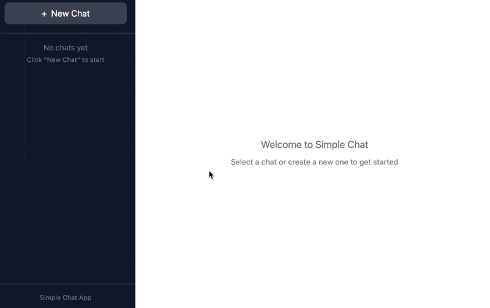

# Simple Chat App

A Stock Zeroisation chat assistant using the Claude Agent SDK with a React
frontend and Express backend. The agent's tools are provided by `../mcp/`,
which proxies to the real Auth/Validation/Stock backend under `../services/`.


## Getting Started

### Prerequisites

- Node.js 18+
- Claude Agent SDK credentials (set `ANTHROPIC_API_KEY` environment variable)
- The mock backend running: `cd ../services && docker-compose up --build`
  (or the three `./gradlew :xxx:bootRun` processes directly — see
  `../README.md`'s "Phase 1 — Mock Services" section)
- The MCP server built: `cd ../mcp && npm install && npm run build`

### Installation

```bash
npm install
cp .env.example .env   # then set ANTHROPIC_API_KEY; STOCK_API_BASE_URL
                        # defaults to the docker-compose gateway
```

### Running

```bash
npm run dev
```

This starts both:
- **Backend** (Express + WebSocket) on http://localhost:3001
- **Frontend** (Vite + React) on http://localhost:5173

Open http://localhost:5173 in your browser.

## Login

The chat is gated behind a login form — there's no way to reach the chat UI
without signing in first. Login is a direct server-side call to the real
Auth service (`POST /api/login` then `GET /api/me`, see `server/src/app.ts`'s
`POST /api/auth/login`), not something the agent negotiates; the resulting
identity (token, `employee_id`, `storeId`) is baked into that chat's system
prompt (`server/src/ai-client.ts`) so the agent never calls
`authenticate_user`/`get_user_details` itself.

Use the mock credentials seeded in `services/auth-service` (see
`../README.md`'s "Mock data" section) — e.g. `priya.k` / `password123`.

## Production Considerations

This is an example app for demonstration purposes. For production use, consider:

1. **Isolate the Agent SDK** - Move the SDK into a separate container/service.

2. **Persistent storage** - Replace the in-memory `ChatStore` with a database. Currently all chats are lost on server restart.

3. **Transcript syncing** - For Agent Sessions to be persisted across server restarts, you'll need to persist and restore the SDK's conversation transcripts. The SDK maintains internal state for multi-turn conversations that must be synced with your storage.

4. **Real session/token handling** - The login token currently lives in the client's React state and gets baked verbatim into each chat's system prompt. A production version would use a proper session mechanism (e.g. an httpOnly cookie + server-side session store) instead of trusting the client to carry the token, and would refresh/expire it rather than treating it as good for the lifetime of the chat.

## Demo

